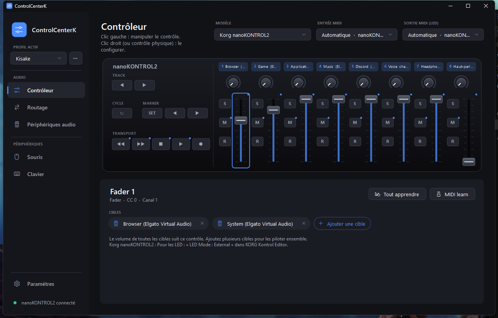
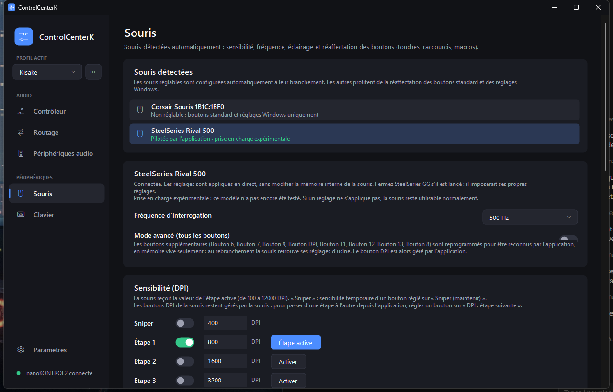
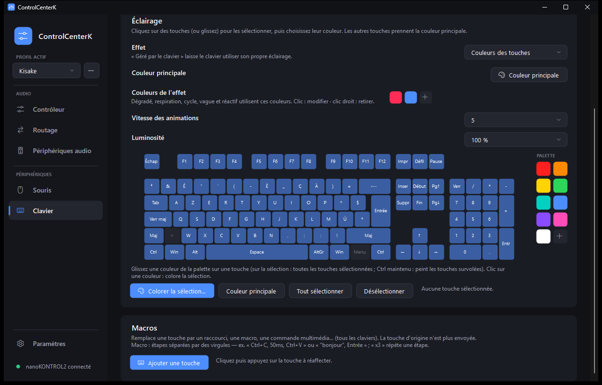

# ControlCenterK

**Le centre de contrôle léger de votre bureau Windows : son, contrôleurs MIDI, souris et clavier, réunis dans une seule application sombre, rapide et sans compte.**

ControlCenterK remplace plusieurs logiciels lourds (mixeur MIDI, console de routage audio, logiciels de souris et de clavier des fabricants) par un seul petit exécutable. Il reste discret dans la zone de notification et ne consomme quasiment rien quand on ne s'en sert pas.

[**⬇ Télécharger la dernière version**](https://github.com/KisakePro/ControlCenterK/releases/latest) · Windows 10 / 11 · installation sans droits administrateur



---

## Ce qu'il sait faire

### 🎚️ Contrôleur MIDI
Pilotez le volume de Windows avec un contrôleur physique.
- Chaque **fader** ou **potentiomètre** règle une ou plusieurs cibles : sortie ou micro par défaut, un périphérique précis, une application (Discord, Spotify, un jeu…), l'application au premier plan, les sons système…
- Les **boutons** coupent le son, changent le périphérique par défaut, envoient des touches multimédia ou changent de profil.
- **Contrôleur à l'écran interactif** : clic gauche pour bouger un fader ou appuyer sur un bouton, clic droit pour le configurer.
- **Profils** que l'on crée, duplique, exporte et importe (fichier `.json`).
- **Filtre anti-tremblement** : seul un mouvement franc compte, les micro-variations d'un fader au repos sont ignorées.
- Retour **LED**, courbe de volume réglable, **MIDI learn** pour les contrôleurs reprogrammés.
- Contrôleurs pris en charge : Korg nanoKONTROL2 et les contrôleurs MIDI les plus répandus (X-Touch Mini, APC mini…), plusieurs à la fois.

### 🔀 Routage audio
Une console façon Voicemeeter, intégrée.
- Envoyez n'importe quelle entrée (micro, ou tout ce qui est joué sur une sortie) vers plusieurs sorties à la fois : casque **et** enceintes, par exemple.
- Gain en dB, muet, vumètres, délai par sortie pour synchroniser les appareils.
- Trois vues : **Console**, **Matrice** (un clic par liaison) et **Cartographie**.
- **Périphériques audio virtuels** : l'application crée de vraies cartes son (« Haut-parleurs » / « Microphone ») visibles par tous vos logiciels, pour faire circuler le son entre eux.

### 🖱️ Souris
Branchez une souris : elle est **détectée automatiquement** et configurée.
- **Sensibilité (DPI)** en étapes, mode sniper, **fréquence d'interrogation**.
- **Éclairage** : couleurs par zone, respiration, arc-en-ciel.
- **Boutons réaffectables** : raccourci clavier, macro, clic, média, volume, changement de DPI… « Détecter un bouton » : appuyez, il apparaît dans la liste.
- Chaque modèle garde ses propres réglages.

| Marque | DPI | Fréquence | Éclairage | Boutons supplémentaires |
|---|:-:|:-:|:-:|:-:|
| Corsair (Nightsword, M65, Scimitar, Ironclaw…) | ✔ | ✔ | ✔ | ✔ |
| SteelSeries (≈ 70 modèles : Rival, Sensei, Aerox, Prime…) | ✔ | ✔ | selon le modèle | ✔ |
| Razer (≈ 90 modèles : DeathAdder, Viper, Basilisk…) | ✔ | ✔ | logo / molette | — |
| Logitech G (filaires et Lightspeed) | ✔ | ✔ | — | — |
| Toutes les autres souris | boutons milieu / précédent / suivant / molette inclinée, réglages Windows |||



### ⌨️ Clavier
- **Éclairage touche par touche** sur un clavier dessiné à l'écran, avec libellés AZERTY / QWERTY.
- **Palette de couleurs** à glisser directement sur les touches.
- **Effets** avec vos couleurs : dégradé, respiration, cycle de couleurs, vague, arc-en-ciel, réactif (les touches s'allument quand on tape).
- **Macros sur n'importe quelle touche**, pour tous les claviers.

| Marque | Éclairage |
|---|---|
| SteelSeries Apex (M750, 5, 7, 9, Pro) | touche par touche |
| Corsair K65 / K70 / K95 / Strafe RGB | tout le clavier |
| Razer | tout le clavier |
| Tous les claviers | macros |



### 🎨 Et aussi
- **Thème sombre** personnalisable : couleur d'accent, teinte du fond, thèmes enregistrés.
- **Modules** activables séparément : un module désactivé ne charge rien du tout.
- **Mises à jour** intégrées depuis GitHub (empreinte SHA-256 vérifiée).
- Réglages dans un dossier `config` à côté de l'application (emplacement modifiable).

---

## Installation

1. Téléchargez `ControlCenterK-Setup.exe` depuis la [dernière version](https://github.com/KisakePro/ControlCenterK/releases/latest).
2. Lancez-le : installation pour votre utilisateur, sans droits administrateur, avec raccourcis et démarrage avec Windows en option.

Fermer la fenêtre ne quitte pas l'application : elle reste dans la zone de notification (clic pour l'ouvrir, clic droit → Quitter).

> **Bon à savoir**
> - Fermez les logiciels des fabricants (iCUE, G HUB, Synapse, SteelSeries GG) : ils imposeraient leurs propres réglages.
> - Les réglages de souris et de clavier sont envoyés **en direct** : rien n'est écrit dans la mémoire interne de vos périphériques, qui retrouvent leurs réglages d'usine au rebranchement.
> - Les modèles non testés sont signalés « expérimental » dans l'application.
> - Les périphériques audio virtuels utilisent le pilote libre [usbip-win2](https://github.com/vadimgrn/usbip-win2), à installer une fois.

---

## Pour les développeurs

Aucun outil à installer : le projet se compile avec le compilateur C# fourni avec Windows (.NET Framework 4.8).

```bat
build.cmd
```

- `bin\ControlCenterK.exe` : l'application (un seul fichier, utilisable sans installation)
- `dist\ControlCenterK-Setup.exe` : l'installateur

```
src/Engine.cs, Midi.cs, CoreAudio.cs   contrôleurs MIDI et volumes Windows (WASAPI)
src/Router/                            routage audio et périphériques virtuels
src/Mouse/                             détection et pilotes des souris
src/Keyboard/                          détection, pilotes et effets des claviers
src/UI/                                interface
setup/                                 installateur
```

**Publier une version** : modifier `src/Version.cs`, ajouter la section correspondante dans `CHANGELOG.md`, puis pousser un tag `vX.Y` : GitHub Actions compile et publie la release.

## Remerciements

Les protocoles des périphériques s'appuient sur la documentation de projets libres : [OpenRGB](https://gitlab.com/CalcProgrammer1/OpenRGB), [openrazer](https://github.com/openrazer/openrazer), [rivalcfg](https://github.com/flozz/rivalcfg), [libratbag](https://github.com/libratbag/libratbag) et [ckb-next](https://github.com/ckb-next/ckb-next).
